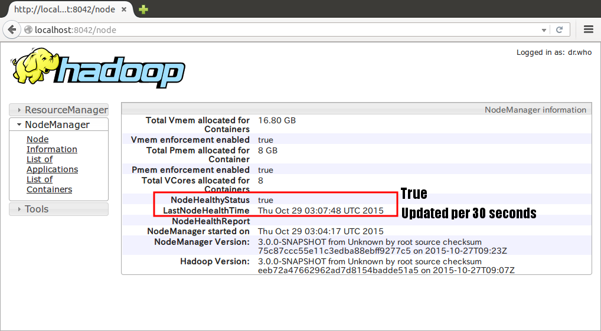
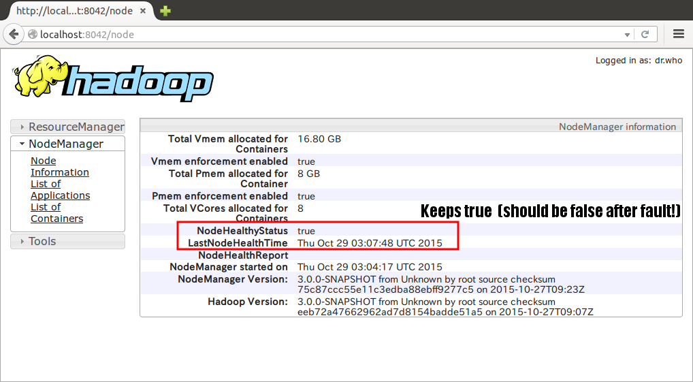

# YARN Bug [YARN-4301](https://issues.apache.org/jira/browse/YARN-4301): NM disk health checker should have a timeout

The YARN disk health checker verifies a disk by executing `mkdir` and `rmdir` periodically.

If these operations does not return in a moderate timeout, the disk should be marked bad, and thus `NodeHealthyStatus` should flip to false.

We found this bug using Namazu, though the bug is *not* non-deterministic.

## YARN Version
commit `96677be`([hadoop-docker-nightly:20151027](https://github.com/AkihiroSuda/hadoop-docker-nightly/tree/20151027))

## How to Reproduce the Bug with Namazu

Unlike other experiments, we don't use `nmz run` in this experiment, because we are not so much interested in non-determinism.

    $ go build -o mypolicy mypolicy.go
    $ mkdir -m 777 /tmp/nmzfs-orig /tmp/nmzfs-mnt
    $ sudo ./mypolicy inspectors fs -autopilot config.toml -mount-point /tmp/nmzfs-mnt -original-dir /tmp/nmzfs-orig

After started Namazu, you can start the YARN testbed. The YARN uses `/nmzfs/nm-local-dir` as the `yarn.nodemanager.local-dirs` property.

    $ docker build -t yarn_testbed yarn_testbed
    $ docker run -i -t --rm -p 8042:8042 -v /tmp/nmzfs-mnt:/nmzfs yarn_testbed

Open [http://localhost:8042/node](http://localhost:8042) in a web browser, and make sure that `NodeHealthyStatus` is `true`, and `LastNodeHealthTime` is updated per 30 seconds.

Then let's inject the fault to YARN, by sending `SIGUSR1` to the `mypolicy` process.

    $ sudo killall -SIGUSR1 mypolicy

After sending `SIGUSR1`, Namazu injects very long sleep (10 minutes) to each of filesystem operations in `/nmzfs/nm-local-dir`.

Unfortunately, YARN cannot detect such a disk failure.
The value of `NodeHealthyStatus` keeps `true`, though `LastNodeHealthTime` gets stuck.

We consider this behavior as a bug.

### Clean up

    $ docker rmi yarn_testbed
    $ sudo fusermount -u /tmp/nmzfs-mnt
    
